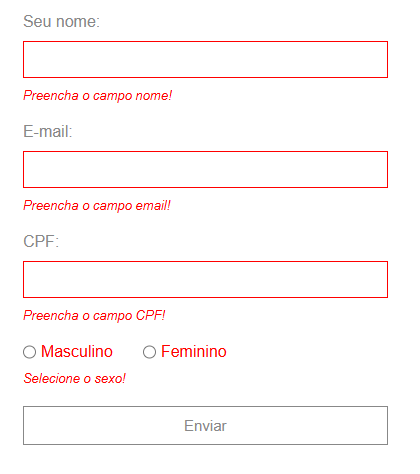
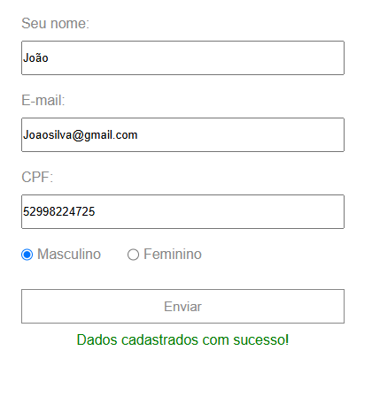

# Desafio | Frontend Developer
 
  

Esse projeto consiste na criação de uma *página web simples* com **HTML**, **CSS** e **JavaScript**. 

## ⚙️ Sobre o projeto

Toda a criação e implementação das funcionalidades do projeto tem como base o  repositório [Desafio Frontend Developer](https://github.com/thiagocontaparatestes/testes-vaga-emprego/blob/main/teste-html-css-js.md).

### Objetivos do projeto

- Criação da página de acordo com o [Layout](https://xd.adobe.com/spec/4025e242-a495-4594-71d2-5fd89d774b57-3614/specs/) fornecido. Respeitando as margens e espaçamentos e trabalhando conceitos como **responsividade** e **HTML semântico**.
- Realizar a consulta dos dados em uma [API](https://frontend-intern-challenge-api.iurykrieger.vercel.app/products?page=1) que contém informações como imagem, preço e nome do produto. A cada produto retornado pela API, um **card do produto** deve ser criado na seção de produtos da página.
- Criação e validação dos formulários da página, onde cada campo deve ter seu **conteúdo validado** de acordo com a informação *(ex: O campo CPF deve conter um CPF válido)*.
- Fazer o **versionamento do código** documentando cada etapa do projeto.

## ✨ Visualização do projeto

>*Versão desktop*

>*Versão mobile*

>*Validação do formulário*

## 💻 Como visualizar o projeto no seu dispositivo?

- Você pode acessar o site hospedado clicando **[AQUI](https://guuzta.github.io/index.html)**. 

- Para acessar o repositório com o código fonte do projeto no GitHub é através *[deste link ](https://github.com/Guuzta/desafio_frontend_developer.git)*.

- Ou se preferir, pode baixar os arquivos diretamente na sua máquina em **[baixar arquivos](https://github.com/Guuzta/desafio_frontend_developer/archive/refs/heads/master.zip)**.

#
 
 
 

<i>Obrigado por acessar o projeto =)</i>
